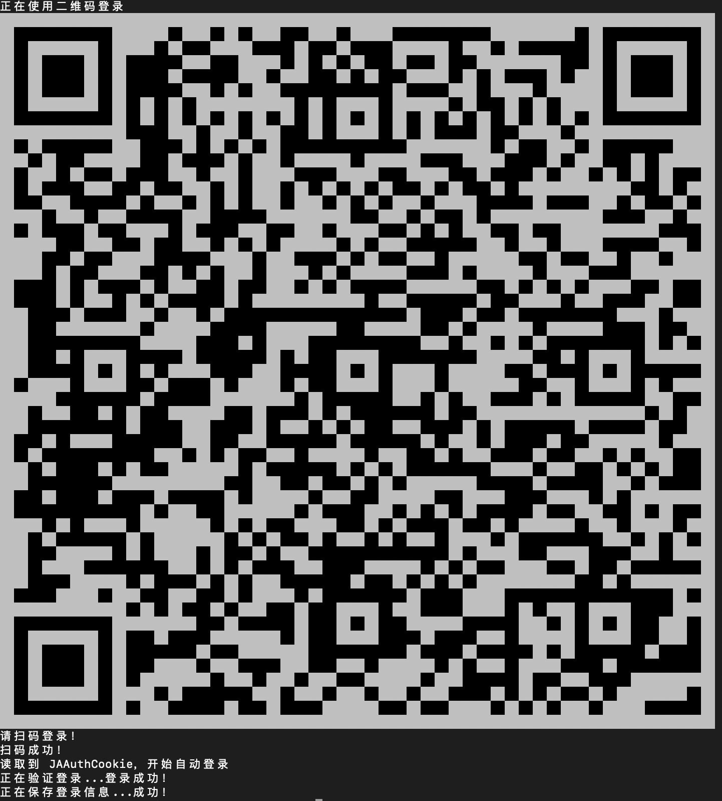
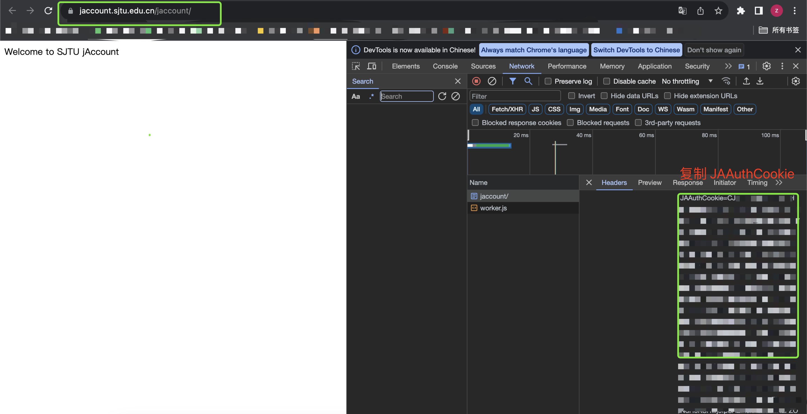

<p align="center">
  
   
   
  
</p>

[JboxTransfer](https://github.com/1357310795/JboxTransfer) 配套 CLI 程序，基于 golang 开发。欢迎提出 issues 和 pr。

# 下载及安装

见 [Release](https://github.com/Okabe-Rintarou-0/JboxTransferCLI/releases)。

# 注意⚠️
在使用过程中，会在当前目录生成一个名为 `session.json` 的文件，该文件包含了登录会话信息，为了保证功能的正常使用，请勿修改。同时，也不要将该文件轻易分享给他人，避免个人信息泄露。

# 如何使用

+ 使用二维码登录：

    ```shell
    ./jtrans login --qrcode
    ```

    由于二维码依赖于终端字体大小，其大小不可控，请最大化终端，并打开微信进行扫码登录：
    
    

+ 复制 `JAAuthCookie` 登录:
    JAAuthCookie 是交大一切网址的“登录通行证”，你可以通过以下方式获得它，并按照 `./jtrans login` 提供的指示粘贴它，并按下回车以进行登录。

    

+ 登出：

    ```shell
    ./jtrans logout
    ```

+ 同步文件：
  + 同步所有文件
  
    ```shell
    ./jtrans sync --all
    ```

  + 递归地同步某个文件夹：

    ```shell
    ./jtrans sync -d REMOTE_DIR_PATH -r
    ```

  + 查看任务队列：
    ```shell
    # 只显示待完成的任务
    ./jtrans sync tasks
    # 显示全部任务
    ./jtrans sync tasks --show-finished
    # 降序排列
    ./jtrans sync tasks --order desc
    # 限制最大行数
    ./jtrans sync tasks --max 10
    ```


+ 清除同步任务：

    ```shell
    ./jtrans sync clear
    ```

+ 查看新旧云盘差异：
    
    ```shell
    ./jtrans diff
    ```

+ 下载单个文件：

    ```shell
    ./jtrans jbox download FILE_PATH
    ```

+ 上传单个文件：

    ```shell
    ./jtrans tbox upload -f LOCAL_PATH -t REMOTE_PATH
    ```

+ 在新云盘创建目录：
    
    ```shell
    ./jtrans tbox mkdir DIR_PATH
    ```

+ 查看文件信息：
  
    ```shell
    ./jtrans tbox info FILE_PATH
    ./jtrans jbox info FILE_PATH
    ```

+ 列出文件夹下的文件：
  
    ```shell
    ./jtrans tbox ls REMOTE_DIR_PATH
    ./jtrans jbox ls REMOTE_DIR_PATH
    ```

+ 一些比较 geek 的操作：

    + 下载文件并计算其 md5 校验和：
        ```shell
        ./jtrans jbox download FILE_PATH --bytes | ./jtrans md5
        ```
    + 下载文件并计算其 crc64 校验和：
        ```shell
        ./jtrans jbox download FILE_PATH --bytes | ./jtrans crc64
        ```
    + 下载文件并上传：
        ```shell
        ./jtrans jbox download FILE_PATH --bytes | ./jtrans tbox upload --bytes -t REMOTE_PATH
        ```

+ 配置黑白名单：
    支持采用 Gitignore 形式的文件来配置同步黑白名单，例如下面的文件：
    ```
    *.docx
    ```
    将不会同步任何以 docx 为扩展名的文件。

+ 更多操作请见：

    ```shell
    ./jtrans --help
    ```